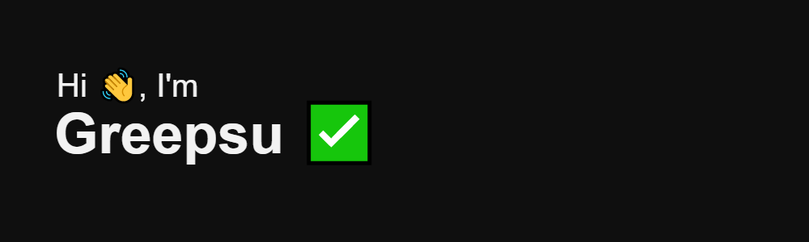

# Welcome to my page ! ☕️

🌍 I'm Arnaud, a self-taught passionate Frontend developer from France. 
💻 I'm an occasional UI/UX Designer who loves making high-quality websites and applications.

## About me:

- ✂️ I’m currently working on a **Uniswap** clone app.
- 🌐 I'm currently using **Javascript, Next.js and NodeJs** for my projects.
- ☑️ I’m currently learning **TypeScript**.
- 📅 I want learn **Solidity** and **Three.js**
- 👯 I’m looking to collaborate on some cool project !
- 🤔 I’m looking for any **tips** or **advice**.
- 🔺 I am an **crypto** and **blockchain** addict.
- 💬 Ask me **anything** !

## What I use:

### Front-end:

     

### Back-end:

    

### Tools:

     

## My Cards:

               

## Links and contact:

